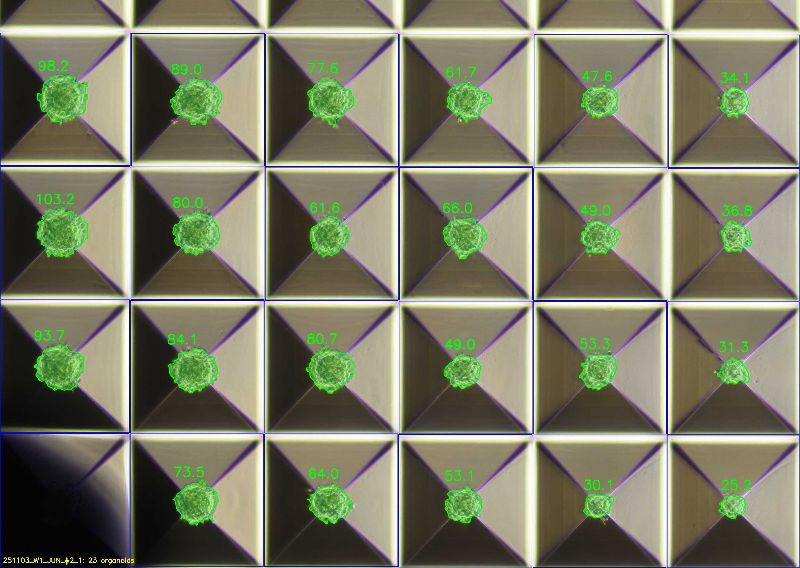

# aggrewell-organoid

Automated organoid area measurement from AggreWell plate images using a two-stage YOLOv8 pipeline.

## Overview

This tool detects and measures organoid areas in AggreWell microwell plates. It uses two pre-trained YOLOv8 models in sequence:

1. **Well detector** (YOLOv8n) — locates microwells via low-confidence detection + RANSAC grid fitting
2. **Organoid segmentor** (YOLOv8n-seg) — segments the organoid in each well crop

Area is computed as: `organoid_mask_pixels / crop_area_pixels * 1000`



## Installation

We recommend using a separate conda environment:

```bash
conda create -n aggrewell python=3.10
conda activate aggrewell
```

Then install from the cloned repository:

```bash
git clone https://github.com/Keon-Woo-Kim/aggrewell-organoid.git
cd aggrewell-organoid
pip install .
```

This installs all dependencies and registers the `aggrewell-organoid` command.

GPU is auto-detected — if CUDA is available, it will be used automatically.

## Usage

Place your plate images (`.jpg`, `.png`, `.tiff`) in a folder, then run:

```bash
aggrewell-organoid path/to/your/images
```

### Options

| Option | Default | Description |
|--------|---------|-------------|
| `--rows` | 4 | Number of well rows |
| `--cols` | 6 | Number of well columns |
| `--exclude` | none | Well to exclude from analysis (e.g. `r3c0`) |
| `--output` | `results/` next to input | Output directory |

### Examples

```bash
# Default: 4x6 grid, all wells included
aggrewell-organoid data/my_experiment

# Exclude a specific well
aggrewell-organoid data/my_experiment --exclude r3c0

# Custom grid size
aggrewell-organoid data/my_experiment --rows 3 --cols 4

# Custom output directory
aggrewell-organoid data/my_experiment --output /path/to/output
```

## Output

Results are saved to the output directory:

| File | Description |
|------|-------------|
| `<name>.xlsx` | Sheet "data" (per-image averages) + sheet "data_raw" (all organoids) |
| `<name>.csv` | Per-image averaged areas |
| `<name>_raw.csv` | Individual organoid areas |
| `*_organoids.jpg` | Annotated plate images with organoid overlays |

Intermediate outputs:
- `crops/` — cropped well images
- `well_preview/` — grid visualization for QC

## How It Works

### Step 1: Well Detection + Cropping

- YOLOv8n detects well candidates at low confidence (conf=0.005, top-30)
- Candidates are filtered by size (70%-130% of median)
- A 5-parameter affine grid (x0, y0, dx, dy, theta) is fitted via RANSAC (3000 iterations)
- Grid is refined by least-squares on all inlier detections
- Each well is cropped at native resolution (no resizing/distortion)

### Step 2: Organoid Segmentation

- YOLOv8n-seg runs instance segmentation on each well crop (imgsz=480, conf=0.5)
- Organoid mask area is computed relative to crop area
- Results are overlaid on original plate images at true positions
- Per-organoid and per-image statistics are exported to CSV/XLSX

## Package Structure

```
aggrewell-organoid/
├── pyproject.toml                          # Package config + dependencies
├── README.md
├── .gitignore
├── docs/
│   └── sample_output.jpg                   # Sample output image
└── src/aggrewell_organoid/
    ├── __init__.py
    ├── cli.py                              # CLI entry point (argparse)
    ├── crop_wells.py                       # Well detection + RANSAC grid fitting
    ├── infer_organoids.py                  # Organoid segmentation + export
    └── models/
        ├── well_detector.pt                # YOLOv8n (bbox)
        └── organoid_detector.pt            # YOLOv8n-seg (instance segmentation)
```

## Notes

- Default grid: 4 rows x 6 columns (24 wells per image)
- Supported image formats: `.jpg`, `.jpeg`, `.png`, `.tiff`
- Images should be AggreWell plate photos (tested on 2880x2048)
- Runs on CPU by default; GPU is used automatically if available
